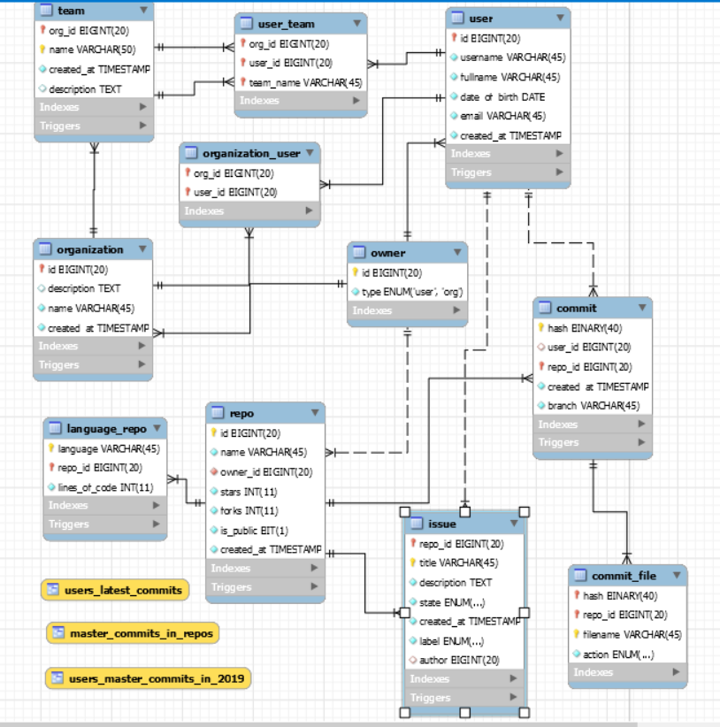
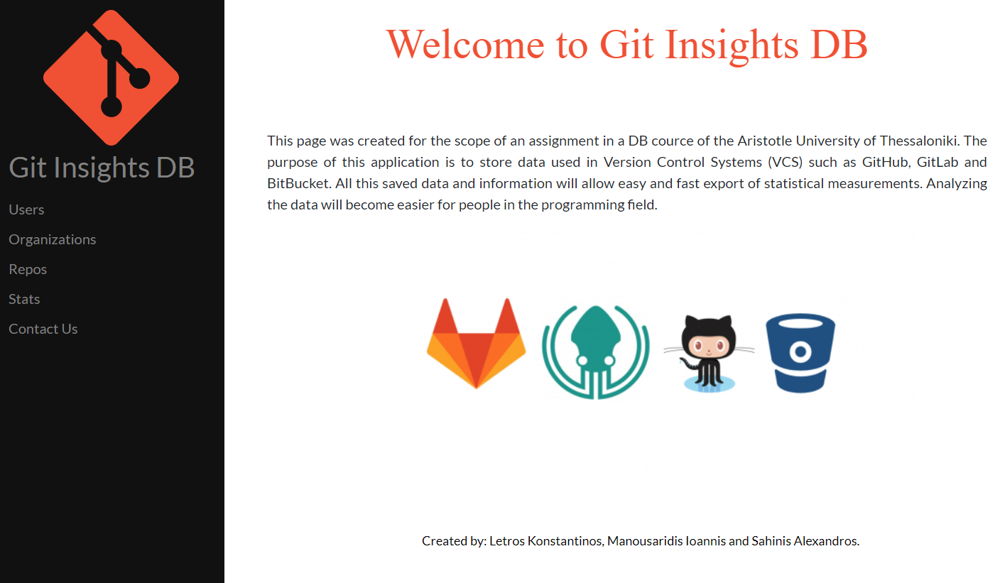
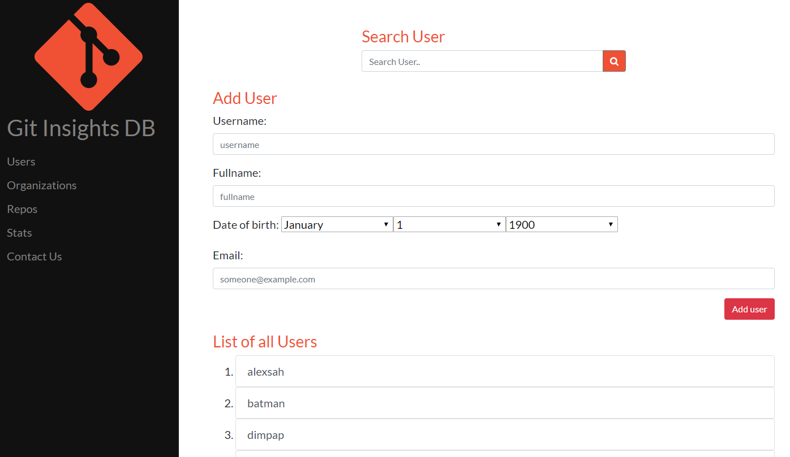
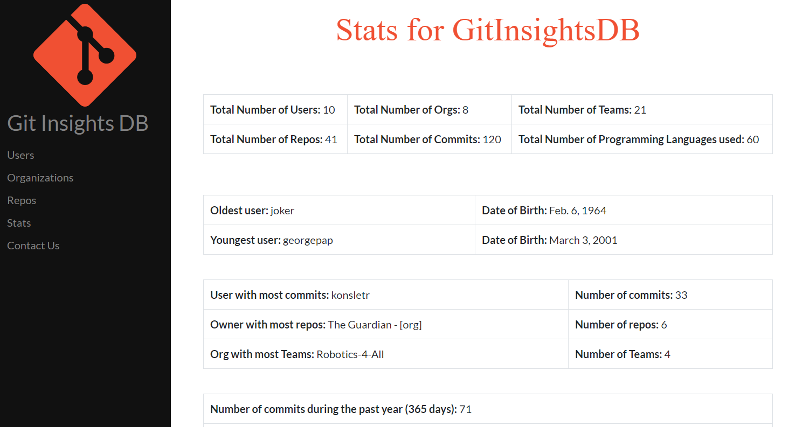
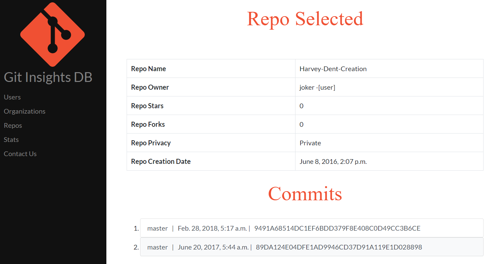

# GitInsightsDB

This is a fully functional database system written in MySQL, Django, HTML/CSS and Bootstrap. 

### Description
This database system was created for the scope of an assignment in a DB cource of the Aristotle University of Thessaloniki during the 2019-20 academic year. The purpose of this application is to store data used in Version Control Systems (VCS) such as GitHub, GitLab and BitBucket. All this saved data and information will allow easy and fast export of statistical measurements. Analyzing the data will become easier for people in the programming field.

 

Below you can see the Relational Model of the DB:

Relational Model|   
:-------------------------:|
  | 

 

Below you can see some snapshots of the frontend:

Welcome Page        |  Users Page
:-------------------------:|:-------------------------:
  |   |
Stats Page            |  Repo Page
  |   |

## Collaborators ✨

<!-- All-Collaborators-LIST:START -->
<table>
  <tr>
    <td align="center"><a href="https://github.com/alexsah-ece"> <b>alexsah-ece</b></a> 💻</td>
        <td align="center"><a href="https://github.com/kosletr"> <b>kosletr</b></a> 💻</td>
  </tr>
</table>

<!-- All-Collaborators-LIST:END -->

## Licenses

